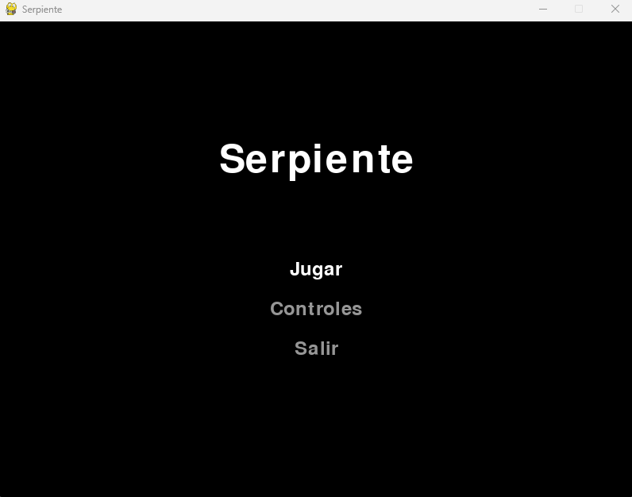
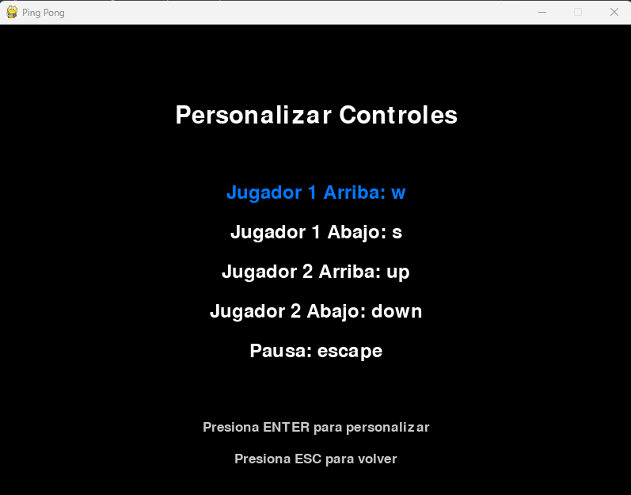
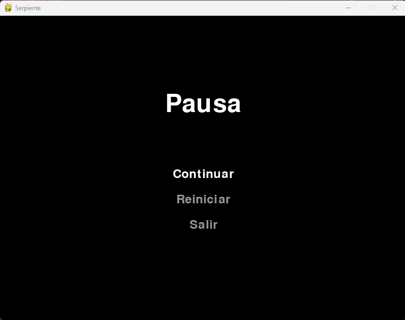
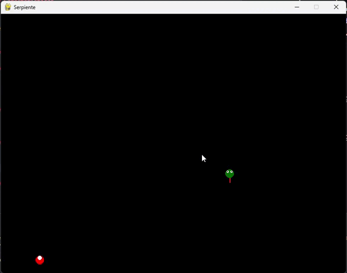

# Juego de la Serpiente

Un clásico juego de la Serpiente implementado en Python utilizando la biblioteca Pygame.

## Descripción

Este proyecto es una versión moderna del clásico juego de la Serpiente. El jugador controla una serpiente que se mueve por la pantalla, comiendo alimentos para crecer. El juego termina si la serpiente colisiona consigo misma.

## Características

- Movimiento suave de la serpiente con segmentos corporales realistas
- Generación aleatoria de comida
- Detección de colisiones
- Menú de pausa con opciones para continuar, reiniciar o salir
- Menú principal con opciones para jugar, ver controles y salir
- Gráficos personalizados de la serpiente, incluyendo ojos y lengua
- Bordes de pantalla envolventes

## Capturas

### Menu principal

### Controles

### Menu de pausa

### Juego

## Requisitos

- Python 3.x
- Pygame

## Cómo jugar

Usa las teclas de flecha para controlar la serpiente:
- ↑: Mover arriba
- ↓: Mover abajo
- ←: Mover izquierda
- →: Mover derecha

Presiona ESC para pausar el juego.

## Controles

- Teclas de flecha: Controlar la dirección de la serpiente
- ESC: Pausar el juego
- Enter: Seleccionar opciones del menú
